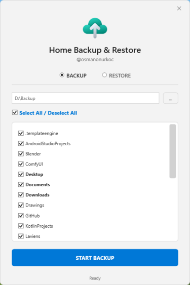
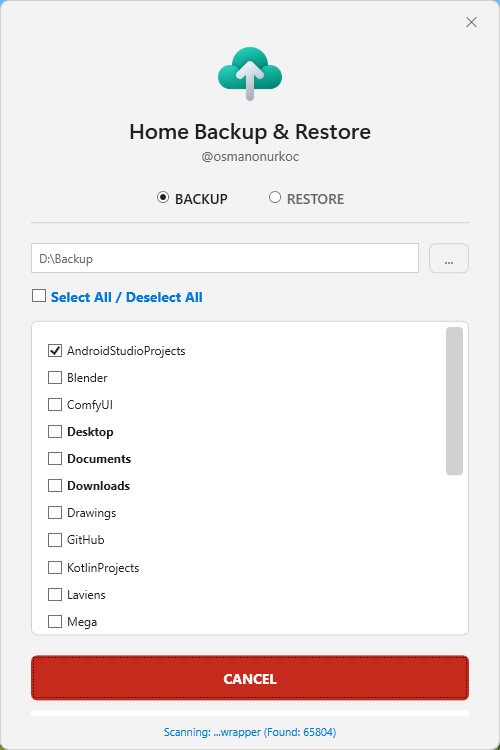
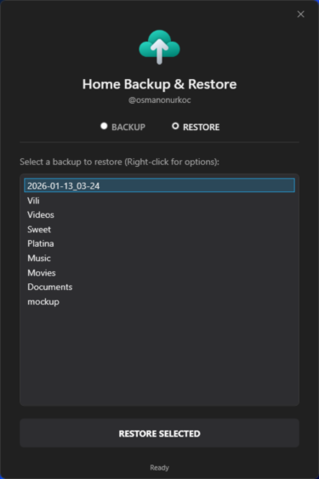
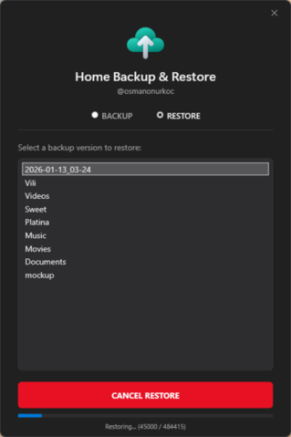
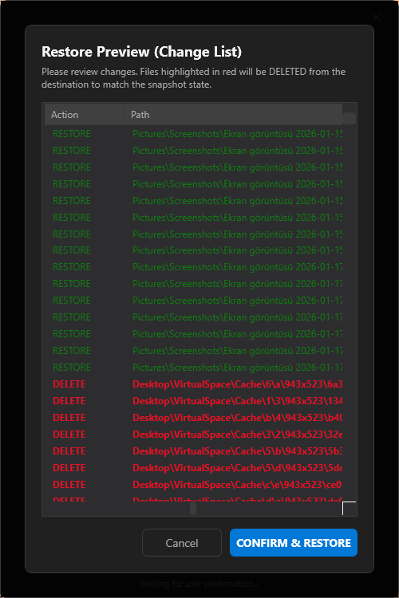

# 📂 Home Backup & Restore Utility (v11.4)

A lightweight, powerful, and intelligent backup tool for Windows, written entirely in PowerShell with a modern WPF GUI. It features **"Time Machine" style incremental backups** using NTFS Hard Links to save disk space while keeping every backup snapshot fully accessible.

[](https://github.com/osmanonurkoc/Rsync_Home_Backup_Restore/releases/latest)


## 📸 Screenshots

<p align="center">
  
  <br/>
  
  <br/>
  
  <br/>
  
  <br/>
  
  <br/>
  
</p>

*A smart, incremental backup utility for Windows built with PowerShell & WPF. Features NTFS hard-linking for storage efficiency, auto-dark mode, and a modern GUI.*

## ✨ Key Features

* **🚀 Smart Incremental Backups (Turbo Mode):** Uses NTFS Hard Links. If a file hasn't changed since the last backup, it links to the old file instead of duplicating it. This saves massive amounts of disk space and time.
* **⚡ Differential Restore:** During restoration, the tool checks if the destination file is already identical (same size and timestamp) to the backup. If so, it skips the copy operation, significantly speeding up the process.
* **🛡️ Safe Mirroring (Context-Aware Clean):** The restore process is now scope-aware. It removes extraneous files *only* within the specific sub-directories being restored. It guarantees that unrelated files in the parent directory (e.g., your Home folder) are never touched.
* **👻 Ghost Folder Cleanup:** Automatically detects and forcibly removes stubborn empty folders that are locked by Windows system attributes (Read-Only/System) or hidden `desktop.ini` files.
* **🎨 Modern UI & Theme Engine:** Automatically detects your Windows theme (Light/Dark mode) and adjusts the interface in real-time.
* **🛡️ Advanced Exclusion System:** Powerful JSON-based exclusion support. Ignore files by extension, specific folders, global folder names, or specific file paths.
* **📂 Restore Manager:** Easily browse, rename, delete, or restore previous backups directly from the interface.
* **📋 Total transparency over your backup process. The tool generates a comprehensive **Difference List** to show you exactly what's happening:

## 🚀 Getting Started

### Prerequisites
* **OS:** Windows 10 or Windows 11.
* **File System:** The backup destination drive **must be formatted as NTFS** to support Hard Links.

### Installation & Usage

#### Option 1: Using the Executable (Recommended)
1. Download the latest `HomeBackup.exe` from the **[Releases Page](https://github.com/osmanonurkoc/HomeBackup/releases/latest)**.
2. Place it in a folder (e.g., `C:\Tools\HomeBackup`).
3. Double-click `HomeBackup.exe` to run.
   * *Note:* The first run will generate configuration files (`settings.json`, `exclude_list.json`) in the same folder.

#### Option 2: Running the Script (For Developers)
1. Download the source code.
2. Right-click `HomeBackup.ps1` and select **Run with PowerShell**.
   * *Note:* If you encounter an Execution Policy error, run this command in PowerShell once:
     ```powershell
     Set-ExecutionPolicy -Scope Process -ExecutionPolicy Bypass
     ```

## 🛠️ How It Works

### Backup (Turbo Mode)
This tool utilizes the Windows Kernel32 API (`CreateHardLink`) to perform deduplication at the file system level:
1.  **First Backup:** Copies all selected files normally.
2.  **Subsequent Backups:**
    * The tool compares files with the *previous* backup snapshot.
    * **If a file has changed (or is new):** It copies the new file physically.
    * **If a file is unchanged:** Instead of copying it again, it creates a **"Hard Link"** pointing to the existing data on the disk.
    * **Result:** Each backup folder looks and acts like a full backup (you can delete old ones without breaking new ones), but it takes up **almost zero extra space** for unchanged files.

### Restore (True State)
1. **Analysis:** Compares the selected snapshot with the target folder.
2. **Differential Check:** Skips overwriting files that are already up-to-date.
3. **Smart Clean:** Removes files from the target that do not exist in the snapshot, ensuring an exact mirror. This is done safely by only scanning the relevant sub-trees.
4. **Attribute Stripping:** Resets system attributes on locked folders to ensure proper cleanup of empty directories.

## ⚙️ Configuration (Exclusions)

You can customize exactly what gets skipped by editing the `exclude_list.json` file. The tool supports advanced filtering logic.

**Example `exclude_list.json`:**
```json
{
  "GlobalExtensions": [".tmp", ".log", ".bak", ".dmp", ".vdi", ".vmdk"],
  "GlobalFolders": ["node_modules", "bin", "obj", ".git", ".vs", "AppData", "cache"],
  "IgnoredSystemFolders": ["$RECYCLE.BIN", "System Volume Information", "OneDriveTemp"],
  "FolderSpecific": {
    "Downloads": [".exe", ".msi"],
    "Videos": [".srt"]
  },
  "IgnoredSpecificFolders": [
    "%UserProfile%\\Desktop\\VirtualSpace"
  ],
  "IgnoredFiles": [
    "%UserProfile%\\Desktop\\SpecificApp.exe",
    "%UserProfile%\\Documents\\LargeLogFile.txt"
  ]
}
```

## ⚠️ Disclaimer

This script is provided "as is", without warranty of any kind, express or implied, including but not limited to the warranties of merchantability, fitness for a particular purpose, and non-infringement. 

**Use at your own risk.**

The author is not responsible for any data loss, file corruption, or system damage that may occur while using this script. Since this tool involves file manipulation (backup and restore), it is strongly recommended that you:
1.  **Review the code** to understand what it does before running it.
2.  **Test the script** in a safe, non-critical environment first.
3.  Ensure you have a separate backup of your critical data before performing a restore operation.


## 📄 License
This project is licensed under the [MIT License](LICENSE).

---
*Created by [@osmanonurkoc](https://github.com/osmanonurkoc)*
